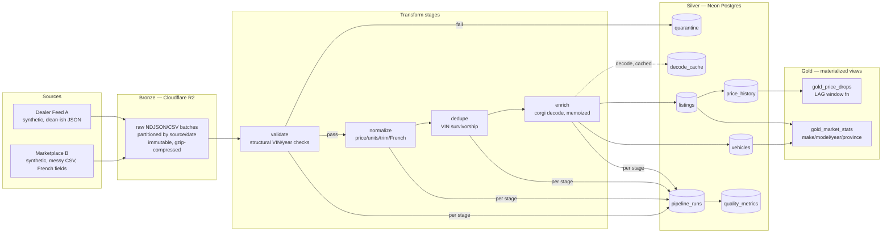

# Dachshund

A mini version of Cardog's "Crawldog" listings pipeline — a small-scale medallion-architecture ETL pipeline for vehicle listing data. Named Dachshund in the spirit of their VIN decoder, [`@cardog/corgi`](https://github.com/cardog-ai/corgi).

**Status: complete.** Bronze (R2 extract) → Silver (validate/normalize/dedupe/enrich/load into Neon Postgres) → Gold (materialized views) all built, tested, and run end-to-end against a real ~550K-record synthetic dataset. See `BENCHMARKS.md` for load/query performance numbers and `PROJECT_BRIEF.md` for the full spec driving this build.

## Why this exists

This project exercises the core mechanics of a real vehicle-listings pipeline: ETL for vehicle data ingestion, data quality and normalization at scale, deduplication, VIN decoding, and PostgreSQL optimization. It's a working (small-scale) version of a real problem: two messy, contradictory vehicle-listing feeds in, one trustworthy Postgres dataset out.

## Architecture (medallion)



Bronze is never edited — it's the replay source of truth. Everything in Silver and Gold is derived and can be dropped and rebuilt from bronze (`npm run replay`, idempotently — see [Idempotency](#idempotency)).

## What's built

### 1. Project scaffolding
TypeScript strict mode, `vitest` for tests (54 passing across 9 files), `tsx` for running TS directly without a build step.

```
src/generator/   VIN construction, seed vehicles, filth injection, listing generation
src/pipeline/    extract, validate, normalize/, dedupe, enrich, load, run (orchestrator), metrics
src/db/          schema.sql, phase3-migration.sql, phase3-post-load.sql, pg client
src/r2/          S3-compatible client for Cloudflare R2
scripts/         capture-reference, benchmark-load, benchmark-queries, metrics-report
reference/       real-listings.json (gitignored — see below)
```

### 2. Cardog API reference capture (`scripts/capture-reference.ts`)
One-time, budget-capped script: makes **exactly 1** live call to `GET /v1/listings/search?limit=10` (not 10 separate calls — the endpoint supports a `limit` param, so one call covers all 10 reference listings). The script refuses to run a second time once `reference/real-listings.json` exists, and aborts before spending any call if `CARDOG_API_KEY` looks like a placeholder.

**What we learned from the real data:**
- The public docs undersell the schema — the *actual* response includes far more than `{id, vin, price, make, model, year, ...}`. Real listings carry **`latitude`/`longitude` directly, plus a full structured `location` object** — coordinates are very much present, contrary to what the docs implied.
- Also present: `verificationStatus`/`verifiedAt`, `previousPrice`/`priceChangedAt` (Cardog already tracks price history at the listing level — validated the `price_history` table design), decoded-reference fields like `makeRef`/`modelRef`/`bodyStyleRef`, and rich vehicle attributes (`cylinders`, `shippingWeight`, `gvwr`) this project's generator doesn't attempt to reproduce.
- **One real bug found in production**: the live call initially 500'd with `DatabaseError` — their backend was passing a JS `Date.toString()` into a SQL query filtering `vehicle_media.updated_at`, instead of an ISO timestamp. A retry succeeded. Total spend: 2 of the allowed 10 calls, 0 calls since — the schema is fully derived from the saved reference file.

### 3. Neon schema (`src/db/schema.sql` + `phase3-migration.sql` + `phase3-post-load.sql`)
Seven tables: `vehicles` (one row per physical VIN, decode-authoritative), `listings` (one row per observed ad, unique on `(source, source_listing_id)` — what makes loading idempotent), `price_history` (append-only, written only when price actually changes), `quarantine` (rejected records + reason codes, deduped by content hash), `pipeline_runs` + `quality_metrics` (observability per stage per batch per run), and `decode_cache` (memoizes corgi decodes by WMI+VDS prefix). Two gold materialized views (`gold_market_stats`, `gold_price_drops`) sit on top. Every table has inline comments explaining the design choice, not just the column. See [Storage-cap saga](#judgment-the-storage-cap-saga) for why the schema evolved mid-project.

### 4. VIN check-digit logic (`src/generator/vin.ts` + `vin.test.ts`)
Full ISO 3779 / NHTSA mod-11 implementation. **Validated directly against the real VIN captured from the Cardog API** (`1VWBH7A30DC104945`, a 2013 VW Passat) — the test suite asserts the computed check digit matches Cardog's real-world data. 8 tests: correct check digit, corrupted check digit detection, wrong-length detection, the classic "check digit = X" edge case, invalid-character rejection, and the year-code 30-year cycle.

### 5. Generator (`src/generator/`)
- `seeds.ts`: 30 real WMI + make/model/year combinations for vehicles commonly sold in Canada.
- `rng.ts`: seeded PRNG (mulberry32) — `--seed` makes every run byte-for-byte reproducible.
- `filth.ts`: price formatting variants (`$34,999`, Quebec-style `35 995 $`), trim spelling variants (`EX-L` → `EXL` / `EX L`), VIN corruption, km→miles conversion.
- `listing.ts`: builds a clean canonical listing, then renders it as a Source A record (English JSON) or Source B record (French CSV: `prix`, `kilometrage`, `marque`, `modele`...).
- `index.ts`: CLI orchestrator. Generates both sources together so it can deliberately reuse ~2% of Source A's VINs in Source B **with contradictory year/price**.

| Filth type | Default rate |
|---|---|
| VIN bad check digit | 7% |
| VIN wrong length | 1% |
| Price missing | 3% |
| Price outlier (absurd) | 0.2% |
| Trim spelling variant | 35% |
| Generic field missing | 4% |
| Odometer secretly in miles (Source B only) | 12% |
| Cross-source VIN overlap w/ contradiction | 2% |

### 6. Extract stage (`src/pipeline/extract.ts`)
Reads locally-generated batch files, gzips them, and lands them in R2 at `bronze/source=<name>/date=<partition>/batch-NNNN.<ext>.gz`. Object keys are deterministic (source + date + batch index), so re-running extract for the same date **overwrites the same keys instead of duplicating**. A `--partition <label>` override lets a differently-sized dataset land without colliding with or deleting an existing partition's bronze data (used for the scale-down — see judgment section). Row counts are tracked via a small JSON manifest per source/date, not R2 object metadata (`ListObjectsV2` doesn't return custom metadata cheaply at scale).

### 7. Validate (`src/pipeline/validate.ts`)
Structural VIN/year checks (own `vin.ts`, **not** `corgi.decode()`) — decode is expensive SQLite pattern matching, unnecessary for a length/check-digit/year-range check and reserved for the enrich stage's deduped unique-VIN set. Reason codes: `vin_missing`, `vin_wrong_length`, `vin_bad_check_digit`, `year_missing`, `year_out_of_range`. Failures are inserted into `quarantine` keyed by an MD5 content hash of `(raw_record, reason_codes)` with `ON CONFLICT DO NOTHING` — replaying the same batch doesn't duplicate the same rejects.

### 8. Normalize (`src/pipeline/normalize/`)
Four independently-tested modules: `price.ts` (plain number / dollar-comma / Quebec-space formats), `units.ts` (km↔miles unification heuristic), `trim.ts` (canonicalization against seed trims), `french.ts` (French→English field mapping for Source B). 19 tests total.

### 9. Dedupe (`src/pipeline/dedupe.ts`)
Groups normalized records by VIN; richest-record-fills-gaps survivorship resolves vehicle-level attributes (make/model/trim/etc.) across sources. **Never drops individual listings** — cross-posted ads from different sources stay as distinct `listings` rows pointing at the same `vehicles.vin`, which is the correct real-world semantics (the same car really is listed by two dealers).

### 10. Enrich (`src/pipeline/enrich.ts`)
Decodes each unique VIN via `@cardog/corgi`, memoized by `vinPrefix()` (first 11 chars — WMI+VDS+check digit+model year+plant, which is all that determines the decode; positions 12–17 are the serial suffix). On the full 502,363-vehicle run this collapsed to **3,234 unique prefixes** — a >150x reduction in actual decode calls. One real corgi quirk found and worked around: `decode()` returns `""` (empty string) for unmatched pattern fields, not `undefined` — a naive `decoded.make ?? survivor.make` would silently clobber a good survivor value with an empty string. Fixed with a `nonEmpty()` helper applied before every `??` fallback.

### 11. Load (`src/pipeline/load.ts`)
Streams into `staging_vehicles`/`staging_listings` temp tables via `COPY` (using `pg-copy-streams`), then does a single set-based `INSERT ... SELECT ... ON CONFLICT DO UPDATE` upsert per table, then inserts `price_history` rows only where the latest observed price differs from `DISTINCT ON (listing_id) ... ORDER BY observed_at DESC` — idempotent price-change detection, not "insert a row every time we see this listing again." See `BENCHMARKS.md` for why COPY over row-insert isn't a minor optimization (535x).

### 12. Orchestrator + observability (`src/pipeline/run.ts`)
Runs validate → normalize → dedupe → enrich → load per date partition, across both sources, in one process — dedupe/enrich/load operate on the **whole run's** records at once (not per batch), because resolving a cross-source VIN overlap requires seeing both sources' records together. Every invocation gets a `run_id` UUID, threaded through every `pipeline_runs`/`quality_metrics` row, so `metrics-report.ts` can query "the results of this specific run" rather than guessing from timestamps (see [Errors and fixes](#notable-bugs-fixed-along-the-way) — this was added after a bug where the wrong run got picked).

### 13. Gold layer (`src/db/phase3-post-load.sql`)
Two materialized views, built **after** bulk load (not before — see benchmarks): `gold_market_stats` (avg/median price + avg odometer by make/model/year/province) and `gold_price_drops` (`LAG()` window function over `price_history` per listing, surfacing the most recent price drop). Refreshed on demand (`REFRESH MATERIALIZED VIEW`), not on every write.

### 14. Benchmarks & metrics tooling
- `scripts/benchmark-load.ts` — COPY vs row-insert timing (`npm run benchmark:load -- --n <rows>`).
- `scripts/benchmark-queries.ts` — 5 representative queries with `EXPLAIN ANALYZE`, `--label` flag to snapshot before/after states.
- `scripts/metrics-report.ts` — CLI report: per-stage timings, quality_metrics, quarantine reason-code breakdown, silver table row counts (`npm run metrics:report -- --run <uuid>`).

Full results: **[`BENCHMARKS.md`](./BENCHMARKS.md)**.

## Idempotency

Every load-bearing table is idempotent by construction, not by convention:
- `listings` unique on `(source, source_listing_id)` → `ON CONFLICT DO UPDATE`.
- `quarantine` unique on `(source, batch_id, content_hash)` → `ON CONFLICT DO NOTHING`.
- `price_history` only gains a row when the latest price actually differs from the prior observation.
- `pipeline_runs`/`quality_metrics` are append-only observability, expected to grow per run — not idempotent by design, and don't need to be.

Proven twice: a small-scale same-batch-twice smoke test during development (row counts identical on the second run), and — incidentally — at full scale, when a 550K-record re-validation pass (triggered by an unrelated concurrent-job failure) reprocessed an already-loaded bronze partition from scratch and produced an unchanged quarantine row count. Full details in `BENCHMARKS.md`.

`npm run replay -- --date <partition>` re-runs the same orchestrator against an already-landed bronze partition — it's the same script as `npm run pipeline`, since idempotency is what makes "replay" and "run" the same operation.

## Key design decisions

- **Coordinates are real, not synthetic-only** — the Cardog reference data proved listings carry lat/lng, so the generator produces per-city coordinates with small jitter.
- **Price as integer cents, not float dollars** (`listings.price_cents`) — avoids floating-point rounding drift on money.
- **No `raw_payload` column on `listings`** — originally present, dropped mid-project once it became the dominant cost against Neon's 512MB cap (see judgment section below). Bronze in R2 is already the immutable, replayable original.
- **Validate uses hand-rolled VIN structural checks, not `corgi.decode()`** — decode is reserved for enrich, run once per unique VIN post-dedup, not once per raw record pre-dedup (a >10x difference in call volume at this dataset's duplication rate).
- **`decode_cache` keyed by an 11-char VIN prefix, not the full 17-char VIN** — positions 12–17 are a serial suffix that never affects the decode result; collapsing on the prefix is what turned 502,363 decodes into 3,234.
- **Two of four `listings` indexes deferred to post-load** (`src/db/phase3-post-load.sql`) — both a genuine Postgres bulk-load best practice (build indexes once in bulk, not incrementally during insert) and a hard requirement to fit the load transaction under the storage cap.
- **Deterministic generation via `--seed`** — every run with the same seed produces byte-identical output, useful for reproducing a specific quarantine/dedup scenario.
- **Generator produces both sources from one coordinated run**, not two independent scripts — required to deliberately create the cross-source VIN overlap with contradictory data.
- **Manifest-based bronze row counts instead of R2 object metadata** — `ListObjectsV2` doesn't return custom metadata cheaply; a small JSON manifest per partition avoids a HeadObject-per-object cost that wouldn't scale.
- **`run_id` UUID on every pipeline_runs/quality_metrics row** — added after a real bug where the metrics report's "most recent run" heuristic (`ORDER BY started_at DESC`) picked a failed retried run instead of the actual last-successful one, because the failed run happened to have more recent per-stage timestamps.

## Judgment: the storage-cap saga

Neon's free tier caps a project at 512MB of storage. This dataset, at its originally-planned 1M-row scale, didn't fit — and getting a real ~500K-row-scale pipeline to run cleanly within that cap, without faking numbers or silently truncating data, was the single hardest and most instructive part of this build. In order:

1. **`raw_payload JSONB` on `listings`** (full original record retained per listing) was the single largest cost — at ~921K listings, 300MB+ on its own. Bronze in R2 is already the immutable original; keeping a second copy in Postgres was redundant from day one, the cap just made the cost impossible to ignore. **Dropped** (user-approved, since this is a real schema/data-shape change, not a reversible tuning knob).
2. **Quarantine grew to 3x its real size** (240,990 rows, 170MB) purely from re-running validate across several retried/crashed pipeline attempts with no dedup key on quarantine inserts. **Fixed** by adding a content-hash unique constraint (user-approved truncate of the reproducible debris, plus the schema fix).
3. **Index maintenance during bulk insert** was itself a storage spike large enough to blow the cap mid-transaction (building 4 indexes incrementally as ~500K rows land is expensive). **Fixed** by deferring 2 of 4 `listings` indexes to a post-load migration — also just the correct Postgres bulk-load pattern independent of the storage constraint.
4. Even after all three fixes, a genuine 1,000,000-row run got through `vehicles` and `listings` but failed loading `price_history`, landing at ~487MB before that table even started — the **steady-state** footprint (not a transient spike) was at the ceiling. At that point the honest options were: upgrade the Neon plan, or scale the dataset down to something that actually fits a free-tier budget without cutting corners on data quality or pipeline correctness. **Scaled down** (user-approved) to 550,000 raw records (350K dealer-feed-a + 200K marketplace-b) landed under a new bronze partition (`--partition` override — non-destructive, didn't touch the original 1M-row bronze data), which produced the final 502,363-vehicle / 506,345-listing / 491,321-price_history-row dataset this README and `BENCHMARKS.md` report on.

The throughline: every one of these was diagnosed with real SQL introspection (`pg_total_relation_size`, `pg_indexes_size`) before acting, and every genuinely destructive step (dropping a column, truncating tables, scaling the dataset down) was surfaced to the user rather than silently worked around. A pipeline that quietly drops data to fit a budget isn't trustworthy; one that hits a real constraint, diagnoses it honestly, and makes a visible, deliberate trade-off is the more realistic engineering story anyway.

## Data sourcing judgment

Real listings at any real volume are proprietary — that's Crawldog's actual business, and scraping real listings isn't something to casually stand up here. The approach is **synthetic-but-schema-accurate**: the generator's field names, VIN structure, and data shape are calibrated against one real, budget-capped pull from Cardog's own API, not guessed from docs (which turned out to undersell the real schema). The engineering problem this project demonstrates isn't "can you scrape car listings" — it's "can you build a pipeline that doesn't trust what it's fed," which is exactly as true of synthetic filth as it is of real-world scraped inconsistency.

**Transport Canada recalls (stretch goal): attempted, abandoned.** The plan was to join a real, unfiltered government dataset (vehicle recalls by make/model) into the gold layer. In practice, Transport Canada's public recalls API returned only schema/field metadata regardless of the make/model query parameters supplied — no actual recall records were ever returned for any query tried. Rather than fabricate recall data or misrepresent an empty response as a working integration, this was dropped; the brief itself scoped this as "if smooth," and it wasn't.

## Notable bugs fixed along the way

- **Generator `stockNumber` collision**: cross-source overlap listings spread `...base`, which included the original `stockNumber` — colliding with a real one, causing `ON CONFLICT DO UPDATE command cannot affect row a second time` during load. Fixed by generating a fresh stockNumber per overlap listing, plus a defensive dedupe-before-COPY pass in `load.ts`.
- **`round(double precision, integer) does not exist`**: `percentile_cont()` returns `double precision` over a `bigint` column with no numeric fast path; Postgres's `round()` only has a two-arg overload for `numeric`. Fixed with an explicit `::numeric` cast in `gold_market_stats`.
- **R2 DNS failures** (`ENOTFOUND` on the virtual-hosted-style bucket subdomain, intermittent) — fixed with `forcePathStyle: true` on the S3 client, avoiding the bucket-subdomain hostname entirely.
- **Stale planner statistics after bulk load**: immediately after creating the deferred indexes, some queries got *no faster* or slightly worse — Postgres's planner was still using pre-load row-count estimates and wasn't confident the new index would win over a seq scan. `ANALYZE vehicles, listings, price_history` fixed it; full before/after/after-analyze numbers in `BENCHMARKS.md`.
- **Wrong run picked by the metrics report**: `ORDER BY started_at DESC LIMIT 1` picked a failed concurrent replay's `run_id` instead of the actual last-successful run, because the failed run's per-stage timestamps happened to be more recent. Fixed by threading an explicit `run_id` UUID through every stage and requiring `--run <uuid>` for a specific report.

## Running it

```bash
npm install
npm run capture:reference          # one-time only — do not re-run, see budget note above
npm run db:apply-schema            # applies src/db/schema.sql to Neon
npm run generate                   # writes data/dealer-feed-a/*.ndjson + data/marketplace-b/*.csv
npm run extract                    # lands data/ into R2 bronze
npm run extract -- --list          # verify what's in bronze (object counts, row counts, per source)
npm test                           # vitest — 54 tests across generator + every pipeline stage

npm run pipeline -- --date <partition>          # validate -> normalize -> dedupe -> enrich -> load
npm run replay -- --date <partition>            # same command — replay is idempotent by construction
npm run db:apply-phase3                         # adds run_id/make/model/model_year columns
npm run db:apply-phase3-post-load               # builds deferred indexes + gold materialized views

npm run benchmark:load -- --n 2000              # COPY vs row-insert timing
npm run benchmark:queries -- --label before      # EXPLAIN ANALYZE on 5 representative queries
npm run metrics:report -- --run <uuid>           # per-stage/per-batch report for a specific run
```

## What's next (beyond this project's scope)

- Upgrade past the Neon free tier and re-run at the originally-planned 1M+ row scale to see the same benchmarks at 2x the data.
- Retry the Transport Canada recalls integration against a different endpoint or with an API key, if one becomes available.
- Scheduled re-ingestion (a second `npm run pipeline` run against a later date partition) to actually populate `gold_price_drops`, which requires two price observations for the same listing and currently has none (every listing in this dataset was loaded exactly once).
