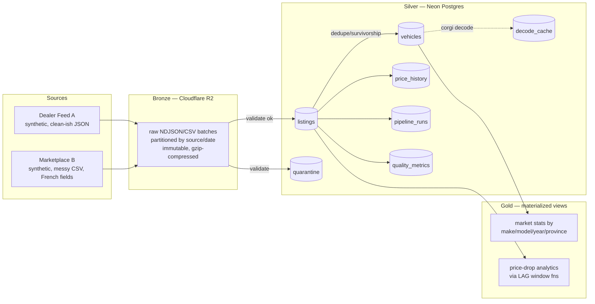

# Dachshund

A mini version of Cardog's "Crawldog" listings pipeline — a small-scale medallion-architecture ETL pipeline for vehicle listing data. Named Dachshund in the spirit of their VIN decoder, [`@cardog/corgi`](https://github.com/cardog-ai/corgi).

**Status: Phase 1 complete** (foundations + extract). Phases 2 (transform: validate/normalize/dedupe/enrich) and 3 (load, optimize, benchmarks, gold views) are not yet built — this README will grow with them. See `PROJECT_BRIEF.md` for the full spec driving this build.

## Why this exists

This project exercises the core mechanics of a real vehicle-listings pipeline: ETL for vehicle data ingestion, data quality and normalization at scale, deduplication, and PostgreSQL optimization. It's a working (small-scale) version of a real problem: two messy, contradictory vehicle-listing feeds in, one trustworthy Postgres dataset out.

## Architecture (medallion)



Bronze is never edited — it's the replay source of truth. Everything in Silver is derived and can, in principle, be dropped and rebuilt with `npm run replay` (Phase 2).

## What's built so far (Phase 1)

### 1. Project scaffolding
TypeScript strict mode (`tsconfig.json`), `vitest` for tests, `tsx` for running TS directly without a build step. Folder layout:

```
src/generator/   VIN construction, seed vehicles, filth injection, listing generation
src/pipeline/    extract.ts (bronze landing) — validate/normalize/dedupe/enrich/load land in Phase 2
src/db/          schema.sql, pg client, apply-schema script
src/r2/          S3-compatible client for Cloudflare R2
scripts/         one-off scripts (Cardog reference capture)
reference/       real-listings.json (gitignored — see below)
```

### 2. Cardog API reference capture (`scripts/capture-reference.ts`)
One-time, budget-capped script: makes **exactly 1** live call to `GET /v1/listings/search?limit=10` (not 10 separate calls — the endpoint supports a `limit` param, so one call covers all 10 reference listings). The script refuses to run a second time once `reference/real-listings.json` exists, and aborts before spending any call if `CARDOG_API_KEY` looks like a placeholder.

**What we learned from the real data:**
- The public docs at docs.cardog.app undersell the schema — the *actual* response includes far more than `{id, vin, price, make, model, year, ...}`. Real listings carry **`latitude`/`longitude` directly, plus a full structured `location` object** (street, city, province, postal code, its own lat/lng) — coordinates are very much present, contrary to what the docs implied.
- Also present: `verificationStatus`/`verifiedAt`, `previousPrice`/`priceChangedAt` (i.e. Cardog already tracks price history at the listing level — validated the `price_history` table design), decoded-reference fields like `makeRef`/`modelRef`/`bodyStyleRef` (suggests an internal canonical taxonomy, which is exactly what corgi + our `vehicles` table role-plays here), and rich vehicle attributes (`cylinders`, `shippingWeight`, `gvwr`, etc.) that this project's generator doesn't attempt to reproduce — out of scope for this project.
- **One real bug found in production**: the live `/v1/listings/search` call initially 500'd with `DatabaseError` — their backend was passing a JS `Date.toString()` (e.g. `"Thu Jul 09 2026 12:19:26 GMT+0000 (Coordinated Universal Time)"`) into a SQL query filtering `vehicle_media.updated_at`, instead of an ISO timestamp. A retry succeeded (looked transient rather than deterministic). Total spend: **2 of the allowed 10 calls**, 0 calls since — the schema is now fully derived from the saved reference file.

### 3. Neon schema (`src/db/schema.sql`)
Seven tables: `vehicles` (one row per physical VIN, decode-authoritative), `listings` (one row per observed ad, unique on `(source, source_listing_id)` — this is what makes loading idempotent), `price_history` (append-only, written only when price actually changes), `quarantine` (rejected records + reason codes, never silently dropped), `pipeline_runs` + `quality_metrics` (observability per stage per batch), and `decode_cache` (memoizes corgi decodes by WMI+VDS prefix so a 1M-row batch doesn't redundantly decode the same vehicle configuration thousands of times). Every table has inline comments explaining the design choice, not just the column.

### 4. VIN check-digit logic (`src/generator/vin.ts` + `vin.test.ts`)
Full ISO 3779 / NHTSA mod-11 implementation (transliteration table, position weights, 30-year model-year-code cycle). **Validated directly against the real VIN captured from the Cardog API** (`1VWBH7A30DC104945`, a 2013 VW Passat) — the test suite asserts the computed check digit matches Cardog's real-world data, not just an internally-consistent synthetic example. 8 tests covering: correct check digit, corrupted check digit detection, wrong-length detection, the classic "check digit = X" edge case, invalid-character rejection, and the year-code 30-year cycle.

### 5. Generator (`src/generator/`)
- `seeds.ts`: 30 real WMI + make/model/year combinations for vehicles commonly sold in Canada (Honda, Ford, Chevrolet, Toyota, Nissan, Hyundai, Kia, VW, BMW, Mercedes, Audi, Volvo, Jeep, Ram, Dodge, Tesla).
- `rng.ts`: seeded PRNG (mulberry32) — `--seed` makes every run byte-for-byte reproducible.
- `filth.ts`: price formatting variants (`$34,999`, Quebec-style `35 995 $`), trim spelling variants (`EX-L` → `EXL` / `EX L` / `EX-L Navi`), VIN corruption (bad check digit, wrong length), km→miles conversion.
- `listing.ts`: builds a clean canonical listing, then renders it as either a Source A record (English JSON) or Source B record (French CSV field names: `prix`, `kilometrage`, `marque`, `modele`...).
- `index.ts`: CLI orchestrator. Generates both sources together (not independently) so it can deliberately reuse ~2% of Source A's VINs in Source B **with contradictory year/price** — that's the cross-source conflict the dedupe/survivorship stage has to resolve in Phase 2.

Filth rates (configurable, doubled-to-tripled under `--chaos`):
| Filth type | Default rate |
|---|---|
| VIN bad check digit | 7% |
| VIN wrong length | 1% |
| Price missing | 3% |
| Price outlier (absurd) | 0.2% |
| Trim spelling variant | 35% |
| Generic field missing | 4% |
| Odometer secretly in miles (Source B only) | 12% |
| Cross-source VIN overlap w/ contradiction | 2% |

### 6. Extract stage (`src/pipeline/extract.ts`)
Reads locally-generated batch files, gzips them, and lands them in R2 at:
```
bronze/source=<dealer-feed-a|marketplace-b>/date=<YYYY-MM-DD>/batch-NNNN.<ndjson|csv>.gz
```
Object keys are deterministic (source + date + batch index), so re-running extract for the same date **overwrites the same keys instead of duplicating** — verified directly (ran extract twice, object count stayed at 1 per source, not 2). Since R2/S3 `ListObjectsV2` doesn't return custom metadata without an expensive per-object `HeadObject` call, row counts are tracked via a small JSON manifest per source/date (`bronze/_manifest/source=<name>/date=<date>.json`) rather than object metadata — cheap to list, and doubles as the input Phase 2's replay logic will read.

## Key design decisions

- **Coordinates are real, not synthetic-only** — since the Cardog reference data proved listings carry lat/lng, the generator produces per-city coordinates with small jitter rather than omitting location, so downstream geographic queries (Phase 3 gold views) have something real to work with.
- **Price as integer cents, not float dollars** in `listings.price_cents` — avoids floating-point rounding drift on money, a classic mistake worth pre-empting rather than debugging later.
- **`raw_payload JSONB` kept on every `listings` row** — even post-normalization, the original filthy record is retained. This means replays/audits don't require re-fetching from bronze for spot-checks, at the cost of some storage.
- **Deterministic generation via `--seed`** — every run with the same seed produces byte-identical output, which matters for reproducing a specific quarantine/dedup scenario when debugging Phase 2.
- **Generator produces both sources from one coordinated run**, not two independent scripts — required to deliberately create the ~2% cross-source VIN overlap with contradictory data, which can't be done if each source is generated in isolation.
- **Manifest-based row counts instead of R2 object metadata** — found out empirically that `ListObjectsV2` doesn't return custom metadata cheaply; a small JSON manifest per partition is a more honest source of truth and avoids a HeadObject-per-object cost that wouldn't scale.

## Data sourcing judgment (preliminary — full version lands in Phase 3)

Real listings at any real volume are proprietary — that's Crawldog's actual business, and 1M+ scraped real listings isn't something to casually stand up here. The approach here is **synthetic-but-schema-accurate**: the generator's field names, VIN structure, and data shape are calibrated against one real, budget-capped pull from Cardog's own API (not guessed from docs, which turned out to undersell the real schema). The engineering problem this project demonstrates isn't "can you scrape car listings" — it's "can you build a pipeline that doesn't trust what it's fed," which is exactly as true of synthetic filth as it is of real-world scraped inconsistency. Real government data (Transport Canada / NHTSA recalls) is planned as a Phase 3 stretch to add one real, unfiltered, un-synthetic data source into the mix.

## Running it

```bash
npm install
npm run capture:reference   # one-time only — do not re-run, see budget note above
npm run db:apply-schema     # applies src/db/schema.sql to Neon
npm run generate            # writes data/dealer-feed-a/*.ndjson + data/marketplace-b/*.csv
npm run extract             # lands data/ into R2 bronze
npm run extract -- --list   # verify what's in bronze (object counts, row counts, per source)
npm test                    # vitest — VIN check-digit + filth injection tests
```

## What's next

- **Phase 2**: validate (quarantine + reason codes) → normalize (price/units/trim/French-field modules, each unit-tested) → dedupe (VIN survivorship) → enrich (corgi decode + `decode_cache`) → observe (`pipeline_runs`/`quality_metrics` populated for real). Idempotency proof (same batch twice, counts don't double) and `npm run replay` from bronze.
- **Phase 3**: COPY-vs-row-insert benchmark, EXPLAIN ANALYZE before/after indexing (`BENCHMARKS.md`), gold materialized views, price-drop `LAG()` analytics, CLI metrics report, full judgment section, and a final Q&A-style list of every design decision worth documenting.
